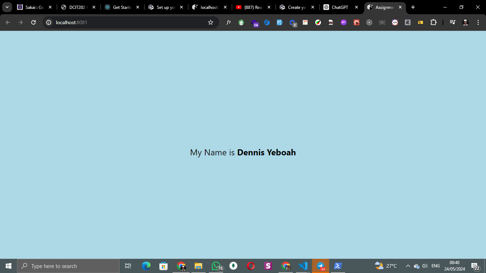

# rn-assignment2-11352458

## Student ID: 11352458

### ASSIGNMENT 2

### Task Description

In this task, you will create a new React Native project using Expo CLI and customize the App.js file to achieve specific styling requirements. The goal is to change the background color of the View component, display a text message with a specific name, increase the font size of the text, and make the name bold. This task helps you understand how to initialize a React Native project and apply basic styles to components.

### App Screenshop

